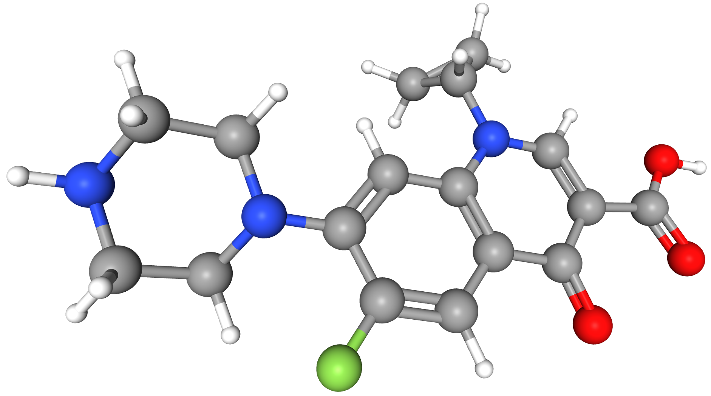

Data Preparation
================

Generating 3D Structures
------------------------
SMILES strings only encode the topology of a molecule, i.e. its atoms and the
bonds between them. There is no 3D information about the direction or distance
between atoms, which is required as a starting point for property prediction using
DFT. Therefore, the first step is generating these 3D structures using a classical
force field. Force fields parameterize the forces between atoms and are used in
classical molecular dynamics simulations. Generating a 3D structure is essentially
running a simulation until the forces reach a potential energy minima.

    Corresponding 3D structure of Ciprofloxacin

This step was performed using `openbabel <https://openbabel.org/wiki/Main_Page>`_,
a Python package for computational chemistry. Specifically, the
`General Amber Force Field <https://ambermd.org/antechamber/gaff.html>`_ (GAFF) was
used, as it is well suited for the small drug-like molecules that ZINC is comprised of.

However, openbabel cannot take advantage of multiple cores, so the input was
split into individual files with 80,000 molecules each. These were processed in
parallel, each taking ~3 hours.

.. code-block:: bash

    # STEP 1: split the training file into smaller files, each with 80000 smiles
    split -l 80000 -d zinc_train.txt zinc_train --additional-suffix=.smi

    # STEP 2: For each smiles file, convert to xyz using GAFF
    for i in *.smi; do
        root=${i%.*}
        obabel -ismi "$i" -oxyz -O "${root}.xyz" --ff GAFF --gen3d &
    done

Out of the 1.9 million molecules, 4 were unable to successfully converge to 3D structures.
They are shown `here <https://github.com/lemmoi/cse490g1final/blob/main/data_prep/failed_smiles.txt>`_
and were removed from the training set.

**CPU hours for this step: ~70**

From 3D Structures to Properties
--------------------------------

Once 3D structures were generated, the Python package
`morfeus (molecular features for machine learning) <https://kjelljorner.github.io/morfeus/>`_
was used to calculate various properties. This package largely serves as wrapper around
other property calculation packages to provide a uniform interface. This project will
only attempt to predict a few of the properties calculated, but more were calculated with
the foresight that they may be used by other researchers in the future.

* Electronic properties (ionization energy, etc.)
    Morfeus calls `XTB <https://xtb-docs.readthedocs.io/en/latest/contents.html>`_, an implementation of
    the semiempirical quantum-mechanical method `eXtended Tight Binding <https://doi.org/10.1021/acs.jctc.8b01176>`_.
    This method maintains accuracy for small molecules, but is orders of magnitude faster than true DFT.

* Dispersion Properties
    The `DFT-D4 package <https://github.com/dftd4/dftd4>`_ was used to calculate dispersion properties, based on
    the `D4 model <https://doi.org/10.1063/1.5090222>`_, which achieves better accuracies than the previous D3 model.

* Solvent accessible surface area (SASA)
    Morfeus uses the `double cubic lattice method <https://onlinelibrary.wiley.com/doi/10.1002/jcc.540160303>`_.

Each of the 3D structure files containing 80,000 molecules was processed in parallel. Unlike openbabel,
these programs can take advantage of multiple cores to speed up execution. Each file was assigned
8 cores and 16 GB of RAM on the `University of Washington HYAK cluster <https://uwrc.github.io/systems>`_
and took approximately 10 hours to complete. The code to do this processing can be found `here <https://github.com/lemmoi/cse490g1final/blob/main/data_prep/xyz_to_morf.py>`_
The result was a CSV file of properties for each split file.

**CPU hours for this step: ~2,000**

Recombining Split Files
-----------------------

Finally, the individual CSV files were `rejoined back together <https://github.com/lemmoi/cse490g1final/blob/main/data_prep/recombine.py>`_
as a csv file for each of the training,
development, and test sets. All files are available at INSERT LINK

